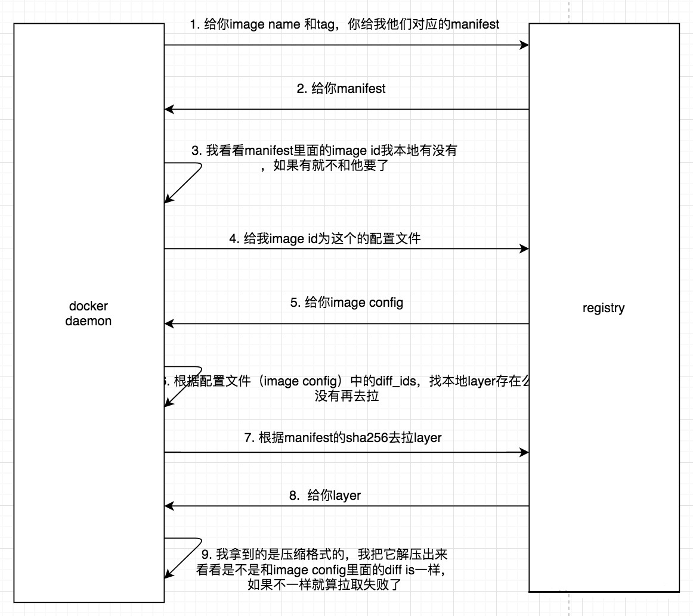
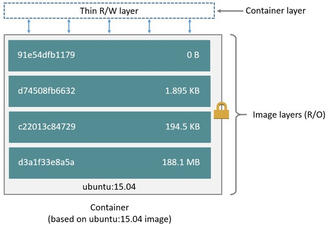
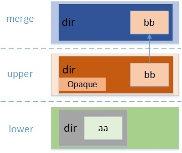

+++
author = "陈sir"
title = "镜像的存储结构"
date = "2021-06-13"
description = "镜像的存储结构"
tags = [
    "docker",
    "容器",
]
categories = [
    "docker",
    "容器",
]
# image = "images/article.jpg"
+++

[toc]

# 镜像的存储结构

我们先来看看当我们拉取镜像时，流程是什么样的



## 核心概念
- [Image Manifest](https://github.com/opencontainers/image-spec/blob/master/manifest.md)
- [Image Configuration](https://github.com/opencontainers/image-spec/blob/master/config.md)


### OCI Image Manifest

镜像清单(manifest)为特定体系结构和操作系统的单个容器映像提供了配置和一组层。manifes是针对registry服务端的配置信息

例子
``` json
{
  "schemaVersion": 2,
  "config": {
    "mediaType": "application/vnd.oci.image.config.v1+json",
    "size": 7023,
    "digest": "sha256:b5b2b2c507a0944348e0303114d8d93aaaa081732b86451d9bce1f432a537bc7"
  },
  "layers": [
    {
      "mediaType": "application/vnd.oci.image.layer.v1.tar+gzip",
      "size": 32654,
      "digest": "sha256:9834876dcfb05cb167a5c24953eba58c4ac89b1adf57f28f2f9d09af107ee8f0"
    },
    {
      "mediaType": "application/vnd.oci.image.layer.v1.tar+gzip",
      "size": 16724,
      "digest": "sha256:3c3a4604a545cdc127456d94e421cd355bca5b528f4a9c1905b15da2eb4a4c6b"
    },
    {
      "mediaType": "application/vnd.oci.image.layer.v1.tar+gzip",
      "size": 73109,
      "digest": "sha256:ec4b8955958665577945c89419d1af06b5f7636b4ac3da7f12184802ad867736"
    }
  ],
  "annotations": {
    "com.example.key1": "value1",
    "com.example.key2": "value2"
  }
}
```

#### digest

digest是对manifest文件的sha256摘要，当镜像的内容变化时，即layer变化，相应的layer的sha256变化，以至manifest变化，从而保证了一个digest（不是镜像名+tag）对应一个镜像。 `一个digest 对应一个image id`

> 通过 digest 解决了相同镜像名+tag 得到不同镜像的问题。 

### OCI Image Configuration

OCI Image是根文件系统变更和容器运行时中使用的执行参数的有序集合。该规范概述了用于描述容器运行时和执行程序的镜像的JSON格式，以及它与文件系统变更集的关系，如Layers所述。

样例
```json
{
    "created": "2015-10-31T22:22:56.015925234Z",
    "author": "Alyssa P. Hacker <alyspdev@example.com>",
    "architecture": "amd64",
    "os": "linux",
    "config": {
        "User": "alice",
        "ExposedPorts": {
            "8080/tcp": {}
        },
        "Env": [
            "PATH=/usr/local/sbin:/usr/local/bin:/usr/sbin:/usr/bin:/sbin:/bin",
            "FOO=oci_is_a",
            "BAR=well_written_spec"
        ],
        "Entrypoint": [
            "/bin/my-app-binary"
        ],
        "Cmd": [
            "--foreground",
            "--config",
            "/etc/my-app.d/default.cfg"
        ],
        "Volumes": {
            "/var/job-result-data": {},
            "/var/log/my-app-logs": {}
        },
        "WorkingDir": "/home/alice",
        "Labels": {
            "com.example.project.git.url": "https://example.com/project.git",
            "com.example.project.git.commit": "45a939b2999782a3f005621a8d0f29aa387e1d6b"
        }
    },
    "rootfs": {
      "diff_ids": [
        "sha256:c6f988f4874bb0add23a778f753c65efe992244e148a1d2ec2a8b664fb66bbd1",
        "sha256:5f70bf18a086007016e948b04aed3b82103a36bea41755b6cddfaf10ace3c6ef"
      ],
      "type": "layers"
    },
    "history": [
      {
        "created": "2015-10-31T22:22:54.690851953Z",
        "created_by": "/bin/sh -c #(nop) ADD file:a3bc1e842b69636f9df5256c49c5374fb4eef1e281fe3f282c65fb853ee171c5 in /"
      },
      {
        "created": "2015-10-31T22:22:55.613815829Z",
        "created_by": "/bin/sh -c #(nop) CMD [\"sh\"]",
        "empty_layer": true
      }
    ]
}
```
##  docker镜像在本地磁盘上的存储
先看看 docker 的根目录以及存储配置

```shell
root@ubuntudev ~# docker info

...

 Server Version: 20.10.7
 Storage Driver: overlay2
  Backing Filesystem: extfs
  Supports d_type: true
  Native Overlay Diff: true
  userxattr: false
 Logging Driver: json-file
 Cgroup Driver: cgroupfs
 Cgroup Version: 1
 Plugins:
  Volume: local
  Network: bridge host ipvlan macvlan null overlay
  Log: awslogs fluentd gcplogs gelf journald json-file local logentries splunk syslog
 Swarm: inactive
 Runtimes: runc io.containerd.runc.v2 io.containerd.runtime.v1.linux
 Default Runtime: runc
 Init Binary: docker-init
 containerd version: d71fcd7d8303cbf684402823e425e9dd2e99285d
 runc version: b9ee9c6314599f1b4a7f497e1f1f856fe433d3b7
 init version: de40ad0
 Security Options:
  apparmor
  seccomp
   Profile: default
 Kernel Version: 5.4.0-74-generic
 Operating System: Ubuntu 20.04.2 LTS
 OSType: linux
 Architecture: x86_64

 ...
 Docker Root Dir: /var/lib/docker
 Debug Mode: false
 Registry: https://index.docker.io/v1/
 Labels:
 Experimental: false
 Insecure Registries:
  127.0.0.0/8
 Live Restore Enabled: false
 ```

 `Docker Root Dir: /var/lib/docker` 和 ` Storage Driver: overlay2` 标明了docker 在本地的存储位置以及使用的存储驱动类型

 而镜像内部的存储结构，是下面这个鬼样子
 
 

### docker目录结构
```shell
root@ubuntudev ~# ll /var/lib/docker
total 44K
drwx--x--x  4 root root 4.0K Jun  7 15:49 buildkit
drwx-----x  4 root root 4.0K Jun 10 16:29 containers
drwx------  3 root root 4.0K Jun  7 15:49 image
drwxr-x---  3 root root 4.0K Jun  7 15:49 network
drwx-----x 49 root root 4.0K Jun 10 16:29 overlay2
drwx------  4 root root 4.0K Jun  7 15:49 plugins
drwx------  2 root root 4.0K Jun  8 13:44 runtimes
drwx------  2 root root 4.0K Jun  7 15:49 swarm
drwx------  2 root root 4.0K Jun 10 16:29 tmp
drwx------  2 root root 4.0K Jun  7 15:49 trust
drwx-----x  3 root root 4.0K Jun  8 13:44 volumes
```

- overlay2: 镜像和容器的层信息
- image：存储镜像元相关信息

### image 目录结构

#### repositories.json
repositories.json就是存储镜像信息，主要是name和image-id的对应，digest和image-id的对应。当pull镜像的时候会更新这个文件。`image-id` 可以用来查找对应的 manifest 与 image-config信息


```shell
root@ubuntudev ~ [127]# cat /var/lib/docker/image/overlay2/repositories.json | python3 -m json.tool
{
    "Repositories": {
       
        "golang": {
            "golang:1.16": "sha256:b09f7387a7195b1cfe0144557a8e33af2174426a4b76cb89e499093803d02e7b",
            "golang@sha256:360bc82ac2b24e9ab6e5867eebac780920b92175bb2e9e1952dce15571699baa": "sha256:b09f7387a7195b1cfe0144557a8e33af2174426a4b76cb89e499093803d02e7b"
        },
        "nginx": {
            "nginx:latest": "sha256:d1a364dc548d5357f0da3268c888e1971bbdb957ee3f028fe7194f1d61c6fdee",
            "nginx@sha256:6d75c99af15565a301e48297fa2d121e15d80ad526f8369c526324f0f7ccb750": "sha256:d1a364dc548d5357f0da3268c888e1971bbdb957ee3f028fe7194f1d61c6fdee"
        } 
    }
}
```


#### distribution

/var/lib/docker/image/overlay2/distribution/diffid-by-digest/sha256 下，记录了layer 从 manifest 到 diff-id 的映射关系，先获取镜像的 manifest。

```shell
root@ubuntudev ~# docker manifest inspect -v nginx
[
        {
                "Ref": "docker.io/library/nginx:latest@sha256:61191087790c31e43eb37caa10de1135b002f10c09fdda7fa8a5989db74033aa",
                "Descriptor": {
                        "mediaType": "application/vnd.docker.distribution.manifest.v2+json",
                        "digest": "sha256:61191087790c31e43eb37caa10de1135b002f10c09fdda7fa8a5989db74033aa",
                        "size": 1570,
                        "platform": {
                                "architecture": "amd64",
                                "os": "linux"
                        }
                },
                "SchemaV2Manifest": {
                        "schemaVersion": 2,
                        "mediaType": "application/vnd.docker.distribution.manifest.v2+json",
                        "config": {
                                "mediaType": "application/vnd.docker.container.image.v1+json",
                                "size": 7732,
                                "digest": "sha256:d1a364dc548d5357f0da3268c888e1971bbdb957ee3f028fe7194f1d61c6fdee"
                        },
                        "layers": [
                                {
                                        "mediaType": "application/vnd.docker.image.rootfs.diff.tar.gzip",
                                        "size": 27145915,
                                        "digest": "sha256:69692152171afee1fd341febc390747cfca2ff302f2881d8b394e786af605696"
                                },
                                {
                                        "mediaType": "application/vnd.docker.image.rootfs.diff.tar.gzip",
                                        "size": 26580149,
                                        "digest": "sha256:30afc0b18f67ae8441c2d26e356693009bb8927ab7e3bce05d5ed99531c9c1d4"
                                },
                                {
                                        "mediaType": "application/vnd.docker.image.rootfs.diff.tar.gzip",
                                        "size": 601,
                                        "digest": "sha256:596b1d696923618bec6ff5376cc9aed03a3724bc75b6c03221fd877b62046d05"
                                },
                                {
                                        "mediaType": "application/vnd.docker.image.rootfs.diff.tar.gzip",
                                        "size": 893,
                                        "digest": "sha256:febe5bd23e98102ed5ff64b8f5987f516a945745c08bbcf2c61a50fb6e7b2257"
                                },
                                {
                                        "mediaType": "application/vnd.docker.image.rootfs.diff.tar.gzip",
                                        "size": 665,
                                        "digest": "sha256:8283eee92e2f756bd57f96ea295e332ab9031724267d4f939de1f7d19fe9611a"
                                },
                                {
                                        "mediaType": "application/vnd.docker.image.rootfs.diff.tar.gzip",
                                        "size": 1394,
                                        "digest": "sha256:351ad75a6cfabc7f2e103963945ff803d818f0bdcf604fd2072a0eefd6674bde"
                                }
                        ]
                }
        },
        ....
]
```
可以看到每一层，都生成了一个sha256摘要，通过层摘要`69692152171afee1fd341febc390747cfca2ff302f2881d8b394e786af605696` 我们到 `/var/lib/docker/image/overlay2/distribution/diffid-by-digest/sha256/`去查询对应的diff-id（记录在oci-imge-config中)。


```shell
root@ubuntudev /v/l/d/i/o/d/d/sha256# ls /var/lib/docker/image/overlay2/distribution/diffid-by-digest/sha256/ | grep 69692152171afee1fd341febc390747cfca2ff302f2881d8b394e786af605696
69692152171afee1fd341febc390747cfca2ff302f2881d8b394e786af605696

root@ubuntudev /v/l/d/i/o/d/d/sha256# cat /var/lib/docker/image/overlay2/distribution/diffid-by-digest/sha256/69692152171afee1fd341febc390747cfca2ff302f2881d8b394e786af605696
sha256:02c055ef67f5904019f43a41ea5f099996d8e7633749b6e606c400526b2c4b33
```

#### imagedb (/var/lib/docker/image/overlay2/imagedb)

在`/var/lib/docker/image/overlay2/imagedb`下，存放着oci-image-config 和 oci-image-manifest，在 manifest `（通过 docker manifest inspect -v nginx 获取）` 的config 字段中，我们可以看到d1a364dc548d5357f0da3268c888e1971bbdb957ee3f028fe7194f1d61c6fdee 这个sha256摘要
/var/lib/docker/image/overlay2/imagedb/content/sha256/d1a364dc548d5357f0da3268c888e1971bbdb957ee3f028fe7194f1d61c6fdee 中可以找到对应的oci-image-config.同时，通过layers的sha256 摘要，我们可以找到对应的diff-id 映射关系.如下
通过image-id 查看 oci-image-config 
```shell
cat /var/lib/docker/image/overlay2/imagedb/content/sha256/d1a364dc548d5357f0da3268c888e1971bbdb957ee3f028fe7194f1d61c6fdee | python3 -m json.tool

...
 "os": "linux",
    "rootfs": {
        "type": "layers",
        "diff_ids": [
            "sha256:02c055ef67f5904019f43a41ea5f099996d8e7633749b6e606c400526b2c4b33",
            "sha256:766fe2c3fc083fdb0e132c138118bc931e3cd1bf4a8bdf0e049afbf64bae5ee6",
            "sha256:83634f76e73296b28a0e90c640494970bdfc437749598e0e91e77eea9bdb6a4e",
            "sha256:134e19b2fac580eff84faabfd5067977b79e36c5981d51fd63e8ac752dbdf9ec",
            "sha256:5c865c78bc96874203b5aa48f1a089d1eabcbe1607edaa16aaa6dee27c985395",
            "sha256:075508cf8f04705d8dc648cfb9f044f5dff57c31ccf34bde32cd2874f402dfad"
        ]
    }
...
```
diff_ids 记录了每层变化的sha256摘要，这样层与diff-id 就对应起来了。
我们在看看镜像中的layer存的是什么
```shell
root@ubuntudev ~# docker image inspect nginx
[
    {
        "Id": "sha256:d1a364dc548d5357f0da3268c888e1971bbdb957ee3f028fe7194f1d61c6fdee",
        "RepoTags": [
            "nginx:latest"
        ],
        "RepoDigests": [
            "nginx@sha256:6d75c99af15565a301e48297fa2d121e15d80ad526f8369c526324f0f7ccb750"
        ],
...
        "GraphDriver": {
            "Data": {
                "LowerDir": "/var/lib/docker/overlay2/23063c7072b8ecb7484c9a5981adc07618ff91d28e379343a045a6ae99dfd53d/diff:/var/lib/docker/overlay2/aa1ac4e25288bca64b6d318684fb5b762f8687268ef9471ac4fb932e66963ba5/diff:/var/lib/docker/overlay2/a689f489f0528bfdfccb022ff4745e3d8ff5749beaeebca3f3cdc8222262b452/diff:/var/lib/docker/overlay2/dea3cfea8d34b61b9073c57e22e18671aa80ab97ebec6fc3d6e56d33c19b77c3/diff:/var/lib/docker/overlay2/8cc45c9b7a0e614745ca1f6b264b39a637d2c77910da368ae7cd10fa9a0bfff0/diff",
                "MergedDir": "/var/lib/docker/overlay2/2ab5d68cf289b00200e349d8ab0e5b94941a7c5c396a4ed17768f866450c93e8/merged",
                "UpperDir": "/var/lib/docker/overlay2/2ab5d68cf289b00200e349d8ab0e5b94941a7c5c396a4ed17768f866450c93e8/diff",
                "WorkDir": "/var/lib/docker/overlay2/2ab5d68cf289b00200e349d8ab0e5b94941a7c5c396a4ed17768f866450c93e8/work"
            },
            "Name": "overlay2"
        },
        "RootFS": {
            "Type": "layers",
            "Layers": [
                "sha256:02c055ef67f5904019f43a41ea5f099996d8e7633749b6e606c400526b2c4b33",
                "sha256:766fe2c3fc083fdb0e132c138118bc931e3cd1bf4a8bdf0e049afbf64bae5ee6",
                "sha256:83634f76e73296b28a0e90c640494970bdfc437749598e0e91e77eea9bdb6a4e",
                "sha256:134e19b2fac580eff84faabfd5067977b79e36c5981d51fd63e8ac752dbdf9ec",
                "sha256:5c865c78bc96874203b5aa48f1a089d1eabcbe1607edaa16aaa6dee27c985395",
                "sha256:075508cf8f04705d8dc648cfb9f044f5dff57c31ccf34bde32cd2874f402dfad"
            ]
        },
        "Metadata": {
            "LastTagTime": "0001-01-01T00:00:00Z"
        }
    }
]
```
#### layerdb (/var/lib/docker/image/overlay2/layerdb)

根据这个名字我们就知道这个目录下肯定是和layer有关系，但是又不是直接存储layer具体数据的地方。
```SHELL
root@ubuntudev /v/l/d/i/o/layerdb# tree -L 2
.
├── mounts
│   └── 48e0fa4e4e4fa327bab180ab3853dcc373e436c997111151aee3de03acd9948c
├── sha256
│   ├── 02c055ef67f5904019f43a41ea5f099996d8e7633749b6e606c400526b2c4b33
│   ├── 03f7c033774a23359e43576911ca4f49da85fde7761b32100214506a8c11c80a
│   ├── 0974d3d3f52e14769c9b344d850668c7d8dd90b2395b330c2e46f62dbdbaab27
│   ├── 0a82463e3d3496f9a1a83cc48ebb2fd4fc8d92ec4b3538efe73c9bf11708b33b
│   ├── 0ec144a6f66fea2d3959fe3b615726d66d9a03d87ff0be042b956b4ca5a49be3
│   ├── 1405602eb1a912ad0bef3b35fc79f4a1eb332cd3ff05b36b560dad11e8d8ca7f
│   ├── 18ea030137dabcaad547a66e9eed42ef495a7f9bf52d1e507c6b34f979c3e6a4
│   ├── 1a126caa7f2df8ccb95a4a08242b527fe3268eebf55cdd72b5b6a7aafd908519
│   ├── 225df95e717ceb672de0e45aa49f352eace21512240205972aca0fccc9612722
│   ├── 246a84598d6332bda90d6b0fda68021d1ee8403999c6fd1968af7525c3545452
│   ├── 3c687783df9abbe54bb587599e87074cfef57777801e45670c479cd1db016f87
│   ├── 3dd8c8d4fd5b59d543c8f75a67cdfaab30aef5a6d99aea3fe74d8cc69d4e7bf2
│   ├── 3f10b66412410e8937e73c1c8094c9a6db34c0a0637de5687d1e5ca2ddde4a40
│   ├── 417cb9b79adeec55f58b890dc9831e252e3523d8de5fd28b4ee2abb151b7dc8b
│   ├── 55a901f6bab27381bc5d8dee7fb14f9fbcf36753c366c47197aeabf2753b21af
│   ├── 56722ee1ee7e73a5c6f96ea2959fa442fb4db9f044399bcd939bb0a6eb7919dc
│   ├── 5751096c56c3e727de4218c15c468d22679f30e68bfbd41b7c395ca92c3373ca
│   ├── 6301b7922b1dd1e35a7f945f8f05d5b737fca94cceffa166c874d4848dba5bc6
│   ├── 688e187d6c79c46e8261890f0010fd5d178b8faa178959b0b46b2635aa1eeff3
│   ├── 75a4cd1ef8331370f675b8b9c293932621a3ac64414692f3f92a7af919feb5ee
│   ├── 892896f425885b2e01ae0c77d1d308ea0a08543287a1b8b339ba587b9aacf01c
│   ├── 8d8dceacec7085abcab1f93ac1128765bc6cf0caac334c821e01546bd96eb741
│   ├── 993148b79c440e61c1921e011ad98785dfaf063bdcc108730722aae9336364c5
│   ├── 9a758de82f7319aeb723830d47636b9953c57ad27888823e8205d0445445e02b
│   ├── 9e25c390aa64802978e7412c73a615fe3010c76cabf160a0eb0b067b78a9e22d
│   ├── a3cb9ead4a37800b48f21921343711275ef1c3c5688b9aa3033d7d180f744ce6
│   ├── a476b265974ace4c857e3d88b358e848f126297a8249840c72d5f5ea1954a4bf
│   ├── ac86975ba6fc6dfc6799e68f6fdb963c0964472b5ebf02d01f5b5036d4ca9917
│   ├── b639806ab48953fe53941bccbaaecc99d82e693585e7b818ff9a6413ef519f25
│   ├── baadac888e70593ef3dfa3708d2260ef8df8cdd3cd3cb257434fdc822f33f01b
│   ├── c44168e5634255949eb51d8e7d449df9237f8964f9a849aa883543c84350da62
│   ├── c657df997c75f6c1a9c5cc683e8e34c6f29e5b4c1dee60b632d3477fd5fdd644
│   ├── c8b6b29fd271057f30beff559e32bef89bf5c995fedd9e10a0992572d54bc4eb
│   ├── ccdbb80308cc5ef43b605ac28fac29c6a597f89f5a169bbedbb8dec29c987439
│   ├── d6db835c4cb30c97215b5ffbafdd1c30fce0addc040ac042af9ef4b2d8ef88da
│   ├── d930b2fbeb473f31f57dccee1f4ab959008b24890c58e65cdbaf20d123eeeba2
│   ├── d9a95f839e2f72d4ddce4ebed02346e610815bbf500d067ca3d11066a8c60bcf
│   ├── e45a5b048544bf403e756c0bf9e09ca8561c0d2d0a43e54c3661153a0418c39d
│   ├── e5333bcc61973898bdde95a3eeb1f728803c14cb3a35c2f31b2b280dde902f17
│   ├── e9e1f772d2a8dbbeb6a4a4dcb4f0d07ff1c432bf94fac7a2db2216837bf9ec5b
│   ├── fb62f6c9191092ec06ee61e41b3d0a000bf2962f372939894754925792622dfe
│   ├── fcc8faba78fe8a1f75025781c8fa1841079b75b54fce8408d039f73a48b7a81b
│   ├── fd6fa224ea91b365084adc1a60d54aeffd6d260704f6855f626758d9ebeeba57
│   ├── fe4ff16afbd5aec9b10d84187b69d99fdc7bb56056393d710896e706a43b3357
│   └── ff45ddc8acc4c3ff484e6711dcc33faa3cded7fc2bd4d830fac30f5017abdf6d
└── tmp
```
可以看到 02c055ef67f5904019f43a41ea5f099996d8e7633749b6e606c400526b2c4b33 和 diff-id 的值相同。查看其下信息
```shell
root@ubuntudev /v/l/d/i/o/l/sha256# ls /var/lib/docker/image/overlay2/layerdb/sha256/02c055ef67f5904019f43a41ea5f099996d8e7633749b6e606c400526b2c4b33/
cache-id  diff  size  tar-split.json.gz
```
其中cache-id 记录的就是实际的layer的数据存放地址。打开看一下
```shell
 cat /var/lib/docker/image/overlay2/layerdb/sha256/02c055ef67f5904019f43a41ea5f099996d8e7633749b6e606c400526b2c4b33/cache-id
3203ae9ea7ebf4e890e1f77b247db30a4ea286e92c0dfd88ab2ce3276fa8b212
```
`3203ae9ea7ebf4e890e1f77b247db30a4ea286e92c0dfd88ab2ce3276fa8b212`就是layer的内容的实际存放地址。查看一下其中的内容
```shell
ls /var/lib/docker/overlay2/3203ae9ea7ebf4e890e1f77b247db30a4ea286e92c0dfd88ab2ce3276fa8b212/diff/
bin  boot  dev  etc  home  lib  lib64  media  mnt  opt  proc  root  run  sbin  srv  sys  tmp  usr  var
```
至此，层的内容就找到了。

## 容器在磁盘上的存储

容器的文件系统分为三层: - r/o层：也就是镜像层 - init层：启动容器时的参数 - r/w层：可读写层

前面我们知道镜像存储在/var/lib/docker/overlay2下面，这里不仅包含了只读（r/o）层，init层和r/w层都在这个里面。 现在我们启动一个容器看看：

```shell
root@ubuntudev ~# docker ps
CONTAINER ID   IMAGE                  COMMAND                  CREATED      STATUS      PORTS                    NAMES
48e0fa4e4e4f   kindest/node:v1.21.1   "/usr/local/bin/entr…"   6 days ago   Up 6 days   0.0.0.0:6443->6443/tcp   kind-control-plane
```
运行一个容器会返回一个容器id. 通过这个id，我们能在/var/lib/docker/image/overlay2/layerdb/mounts目录下找到该容器的信息：
```shell
root@ubuntudev ~# ll /var/lib/docker/image/overlay2/layerdb/mounts/48e0fa4e4e4fa327bab180ab3853dcc373e436c997111151aee3de03acd9948c/
total 12K
-rw-r--r-- 1 root root 69 Jun  7 16:42 init-id
-rw-r--r-- 1 root root 64 Jun  7 16:42 mount-id
-rw-r--r-- 1 root root 71 Jun  7 16:42 parent
```

### docker中的overlayFS

下图展示了overlayFS的两个特征： - 上下合并 - 同名遮盖




[参考](https://zhuanlan.zhihu.com/p/95900321)
[参考](https://blog.csdn.net/luckyapple1028/article/details/78075358)
